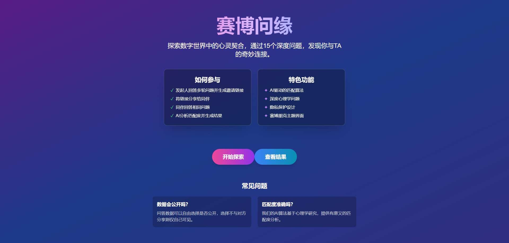

# 赛博问缘 (Cyber Q&A)

[](https://opensource.org/licenses/MIT)
[](https://golang.org/dl/)
[](https://vuejs.org/)

赛博问缘是一个基于Go后端和Vue.js前端的问答匹配应用。通过15个深度问题，帮助用户探索与他人的心理契合度。



## 功能特性

- 🤖 **AI驱动匹配**: 利用AI算法分析两个用户的答案，计算匹配度并生成个性化总结
- 🌐 **双用户问答**: 支持发起人(UserA)和受邀人(UserB)的问答流程
- 🔐 **隐私保护**: 用户可自由选择是否分享自己的答案
- 📱 **响应式设计**: 完美适配PC和移动端，赛博朋克风格界面
- 🔄 **动态问题**: 支持从后端动态加载问题
- 🐳 **Docker支持**: 提供Docker容器化部署方案
- 🗄️ **SQLite数据库**: 使用SQLite进行数据持久化存储

## 技术栈

### 后端
- [Go 1.23](https://golang.org/)
- [GORM](https://gorm.io/) - ORM库
- [SQLite](https://www.sqlite.org/) - 数据库
- [Gorilla Mux](https://github.com/gorilla/mux) - HTTP路由器

### 前端
- [Vue.js 3](https://vuejs.org/) - 渐进式JavaScript框架
- [Tailwind CSS](https://tailwindcss.com/) - 实用优先的CSS框架
- [Pinia](https://pinia.vuejs.org/) - Vue状态管理
- [Vue Router](https://router.vuejs.org/) - Vue路由管理

## 目录结构

```
.
├── pkg/                    # Go后端代码
│   ├── handlers/           # HTTP处理函数
│   ├── models/             # 数据模型
│   ├── database/           # 数据库初始化
│   └── openai/             # OpenAI API客户端
├── frontend/cyberqa/       # Vue.js前端应用
│   ├── src/                # 源代码
│   │   ├── components/     # Vue组件
│   │   ├── views/          # 页面视图
│   │   ├── services/       # API服务
│   │   └── assets/         # 静态资源
│   └── dist/               # 构建后的文件
├── step/                   # 项目文档
├── main.go                 # Go应用入口
├── Dockerfile              # Docker配置文件
├── go.mod                  # Go模块定义
└── system_prompt.txt       # AI系统提示词
```

## 快速开始

### 环境要求

- Go 1.23+
- Node.js 20+
- Docker (可选，用于容器化部署)

### 本地运行

1. 克隆项目:
   ```bash
   git clone https://github.com/your-username/cyberqa.git
   cd cyberqa
   ```

2. 启动后端服务:
   ```bash
   go run main.go
   ```

3. 启动前端开发服务器:
   ```bash
   cd frontend/cyberqa
   npm install
   npm run dev
   ```

4. 访问应用:
   - 前端开发服务器: `http://localhost:5173`
   - 生产环境(构建后): `http://localhost:8088`

### Docker部署

```bash
# 构建镜像
docker build -t cyberqa .

# 运行容器
docker run -d -p 8088:8088 -e OPENAI_API_KEY=your_api_key -e OPENAI_API_BASE=your_api_base -e MODELS=model_name --name cyberqa-app cyberqa

# 访问应用
http://localhost:8088
```

## API文档

### 问答接口

- `POST /api/questions/upload`: 上传问题到数据库
- `GET /api/questions`: 获取问题列表
- `POST /api/submit-user-a`: 提交发起人答案
- `POST /api/submit-user-b`: 提交受邀人答案
- `GET /api/results/:token`: 获取匹配结果

### 环境变量

- `DB_PATH`: SQLite数据库路径 (默认: `cyberqa.db`)
- `PORT`: HTTP服务端口 (默认: `8088`)
- `DIST_PATH`: 前端静态文件路径 (默认: `frontend/cyberqa/dist`)
- `OPENAI_API_KEY`: OpenAI API密钥
- `OPENAI_API_BASE`: OpenAI API基础URL
- `MODELS`: OpenAI 使用的模型 
- `SYSTEM_PROMPT`: AI系统提示词 (默认: `system_prompt.txt`内容)

## 开发指南

### 前端开发

```bash
cd frontend/cyberqa

# 安装依赖
npm install

# 启动开发服务器
npm run dev

# 构建生产版本
npm run build

# 代码检查
npm run lint

# 代码格式化
npm run format
```

### 后端开发

```bash
# 运行应用
go run main.go

# 构建二进制文件
go build -o cyberqa .

# 运行测试
go test ./...
```

## 贡献

欢迎任何形式的贡献！请遵循以下步骤：

1. Fork项目
2. 创建功能分支 (`git checkout -b feature/AmazingFeature`)
3. 提交更改 (`git commit -m 'Add some AmazingFeature'`)
4. 推送到分支 (`git push origin feature/AmazingFeature`)
5. 开启Pull Request

## 许可证

本项目采用MIT许可证，详情请见 [LICENSE](LICENSE) 文件。

---

<p align="center">Made with ❤️ for better connections in the cyber world</p>